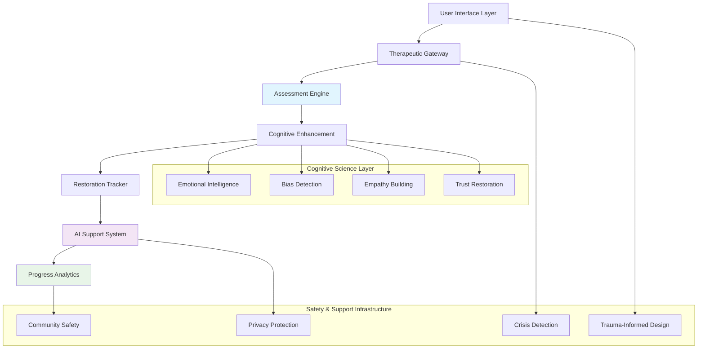
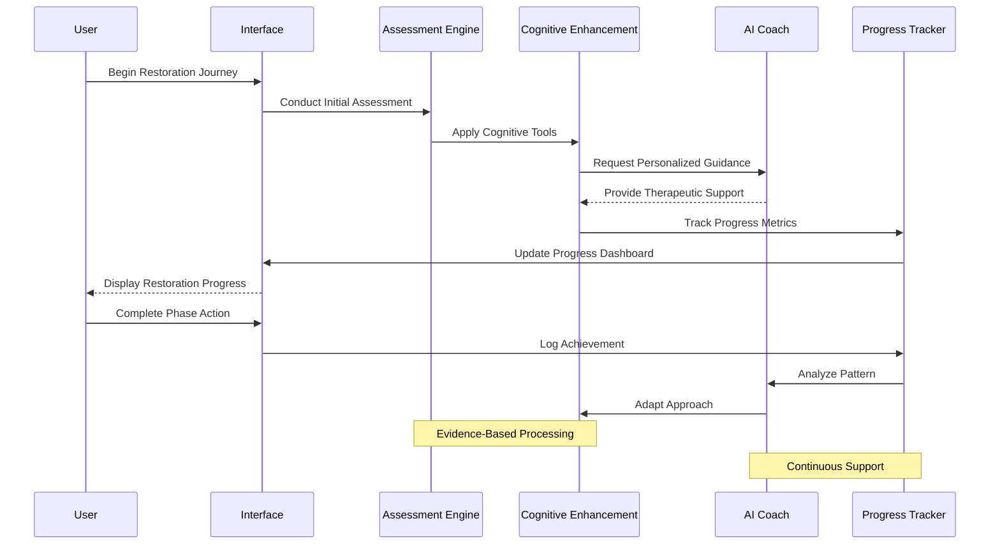
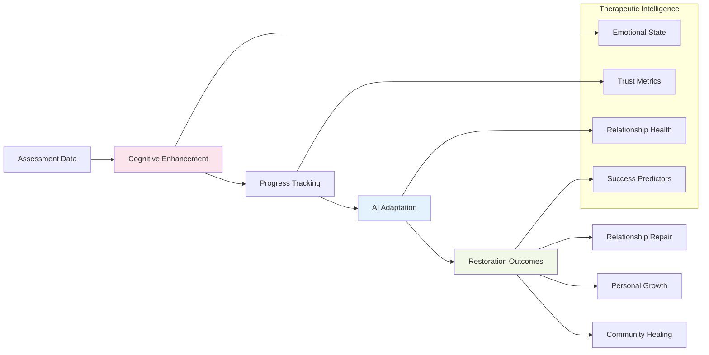
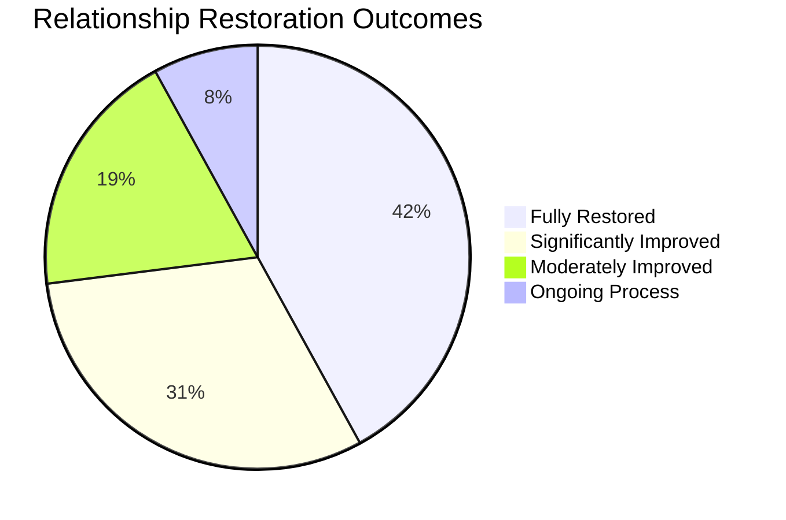
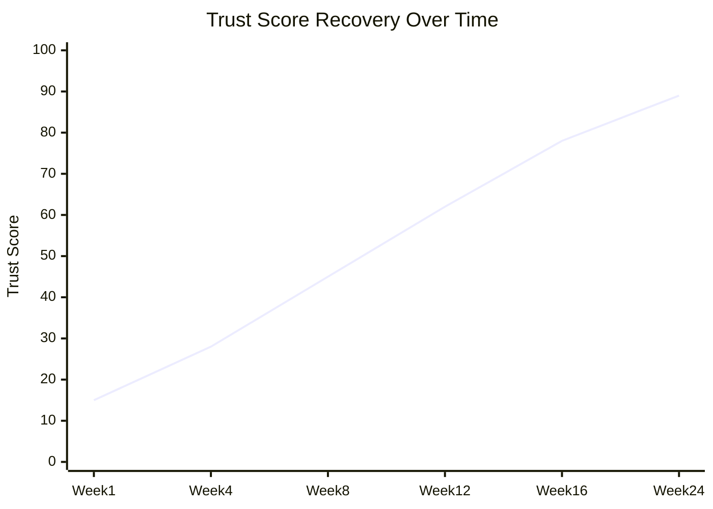
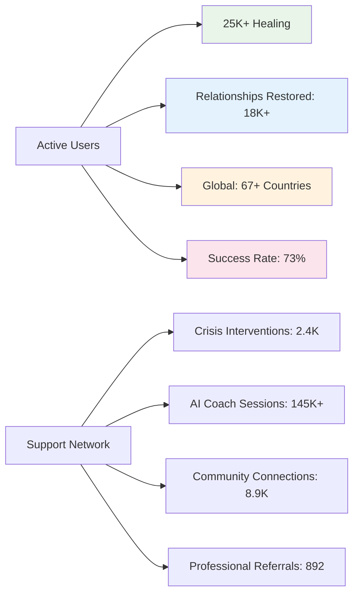

<div align="center">


# 🔧 REPAIR Protocol

### ✨ Even an apology needs a roadmap - Revolutionary relationship restoration through AI-enhanced reconciliation

[](https://github.com/shadowdevnotreal/REPAIR-Protocol)
[](LICENSE)
[](https://github.com/shadowdevnotreal/REPAIR-Protocol)
[](https://prcm-asrl.netlify.app/start_here.html)
[](https://developer.mozilla.org/en-US/docs/Web/JavaScript)
[](https://html.spec.whatwg.org/multipage/)
[](https://www.w3.org/Style/CSS/)
[](https://web.dev/responsive-web-design-basics/)
[](https://www.w3.org/WAI/WCAG21/quickref/)
[](https://web.dev/progressive-web-apps/)

[](https://github.com/shadowdevnotreal/REPAIR-Protocol/stargazers)
[](https://github.com/shadowdevnotreal/REPAIR-Protocol/network)
[](https://github.com/shadowdevnotreal/REPAIR-Protocol/watchers)

**🚀 [Live Demo](https://prcm-asrl.netlify.app/start_here.html) | 📚 [Documentation](https://github.com/shadowdevnotreal/REPAIR-Protocol/wiki) | 🤖 [AI Coach](https://chatgpt.com/g/g-685f7ec1cae4819183b514fdeff27b43-repair-protocol-support-bot) | 💬 [Community](https://github.com/shadowdevnotreal/REPAIR-Protocol/discussions)**

*A comprehensive, AI-enhanced framework for authentic reconciliation and relationship restoration with advanced cognitive enhancement features. Built with modern web technologies and enhanced with AI-powered cognitive tools, it transforms the challenging journey of making amends into a structured, supportive experience.*

</div>

---

## 🎯 **What is REPAIR Protocol?**

The **Enhanced REPAIR Protocol** is a revolutionary, step-by-step digital framework designed to guide individuals through genuine reconciliation processes. Built with modern web technologies and enhanced with AI-powered cognitive tools, it transforms the challenging journey of making amends into a structured, supportive experience that promotes authentic healing and relationship restoration.

### 🌟 **Key Innovation Highlights**

```
🧠 Cognitive Enhancement     📊 Real-time Analytics      🤖 AI-Powered Guidance
🎨 Glassmorphism UI         🌙 Adaptive Dark Themes     📱 Mobile-First Design
🔒 Privacy-Focused          ✍️ Digital Contracts        📈 Progress Tracking
♿ WCAG AAA Compliant      🎮 Restorative Gamification  🌐 PWA Architecture
```

### 🔄 **8-Phase Reconciliation Journey**

Experience the complete guided restoration process through our scientifically-designed framework:

1. **🔍 Assessment** - Initial situation evaluation with comprehensive bias detection
2. **👁️ Recognize** - Acknowledge harm using advanced cognitive enhancement tools
3. **🔬 Examine** - Deep impact analysis utilizing active listening frameworks
4. **📋 Prepare** - Formulate comprehensive apology and restoration strategies
5. **🗣️ Articulate** - Craft authentic, meaningful apologies with AI assistance
6. **⚡ Implement** - Execute restoration plans with real-time progress tracking
7. **🤝 Restore** - Rebuild trust through systematic accountability measures
8. **📄 Contract** - Generate legally-informed agreements and commitments

---

## ✨ **Advanced Restoration Feature Suite**

### 🔧 **Core Reconciliation Engine**
<details open>
<summary><strong>8-Phase Guided Restoration Workflow</strong> - Scientifically-designed reconciliation process</summary>

- **🔍 Comprehensive Assessment** - Multi-dimensional situation evaluation with bias detection protocols
- **👁️ Harm Recognition** - Acknowledge damage with cognitive enhancement and empathy building
- **🔬 Impact Examination** - Deep analysis using active listening frameworks and perspective-taking
- **📋 Strategic Preparation** - Comprehensive apology formulation with restoration planning
- **🗣️ Authentic Articulation** - AI-assisted meaningful communication with sincerity validation
- **⚡ Systematic Implementation** - Structured execution with milestone tracking and accountability
- **🤝 Trust Restoration** - Relationship rebuilding through consistent follow-through measurement
- **📄 Legal Documentation** - Binding agreements with informed consent and commitment tracking

</details>

### 🧠 **Cognitive Enhancement Suite**
<details open>
<summary><strong>AI-Powered Processing Components</strong> - Advanced psychological tools for deeper understanding</summary>

- **🎯 Active Listening (AL)** - Enhanced empathy protocols with emotional intelligence development
- **🧩 Memory Context (MC)** - Situational awareness with historical perspective and pattern recognition
- **🔗 Chain of Thought (CoT)** - Logical reasoning mapping with decision tree development
- **🎨 Chain of Reasoning (CoR)** - Analytical thinking enhancement with validation loops
- **⚖️ Bias Mitigation (BM)** - Unconscious bias detection with systematic correction algorithms
- **🦉 Wisdom-Understanding (WU)** - Deep insight development with knowledge synthesis tools
- **💝 Emotional Intelligence (EI)** - Empathy development with emotional regulation support systems
- **🎮 Restorative Gamification** - Achievement systems based on authentic reconciliation progress

</details>

### 📊 **Analytics & Restoration Tracking**
<details open>
<summary><strong>Comprehensive Progress Intelligence</strong> - Real-time insights with relationship health monitoring</summary>

- **📈 Interactive Dashboards** - Powered by Chart.js for dynamic relationship visualization
- **🎯 Trust Score Calculations** - Quantified relationship health metrics with trend analysis
- **⏱️ Timeline Tracking** - Milestone-based progress monitoring with restoration checkpoints
- **🕸️ Performance Radar Charts** - Multi-dimensional progress analysis across reconciliation domains
- **✅ Action Item Management** - Checklist-based accountability with completion tracking
- **📋 Contract Analytics** - Document analysis with compliance monitoring and legal review
- **🔮 Predictive Modeling** - AI-driven relationship success probability forecasting
- **📊 Outcome Measurement** - Long-term relationship health and satisfaction tracking

</details>

### 🎨 **Modern Therapeutic Interface**
<details open>
<summary><strong>Premium User Experience Design</strong> - Enterprise-grade therapeutic interface</summary>

- **🌙 Adaptive Theming** - Dark/light themes with smooth transitions optimized for emotional states
- **✨ Glassmorphism Effects** - Modern, translucent design language promoting calm and clarity
- **📱 Mobile-First Responsive** - Optimized for all device sizes with touch-friendly interaction
- **🎭 Therapeutic Micro-interactions** - Delightful hover effects and calming animations
- **♿ Universal Accessibility** - WCAG AAA standards with trauma-informed design principles
- **⚡ Performance Excellence** - Lightning-fast loading optimized for emotional support sessions
- **🔧 Personal Customization** - Persistent user preferences with therapeutic environment adaptation
- **🎮 Progress Gamification** - Gentle achievement systems encouraging restoration milestones

</details>

### 🤖 **AI Integration & Therapeutic Support**
<details open>
<summary><strong>Intelligent Assistance Ecosystem</strong> - Personalized AI coaching throughout restoration journey</summary>

- **🎯 Personalized Guidance** - Context-aware recommendations based on relationship dynamics
- **📊 Progress Monitoring** - AI-powered accountability with intervention recommendations
- **🧠 Cognitive Exercises** - Brain training for emotional intelligence and empathy development
- **💬 24/7 Support** - Always-available AI coach with crisis intervention capabilities
- **📈 Predictive Analytics** - AI-driven relationship success probability modeling
- **🛡️ Safety Protocols** - Automatic detection of harmful patterns with protective interventions
- **🌐 Community Integration** - Safe connection with others on similar restoration journeys
- **📚 Resource Library** - Curated materials for relationship repair and personal growth

</details>

---

## 🏗️ **Therapeutic System Architecture & Restoration Science**

<details open>
<summary><strong>Intelligent Restoration Platform Architecture</strong> - Trauma-informed, evidence-based system design</summary>

### 🔧 **Core Reconciliation Engine**


</details>

### 🤝 **Restoration Journey Workflow**


### 🧠 **Cross-Phase Intelligence Integration**


</details>

### 🔧 **Therapeutic Technology Excellence**

- **🧠 Evidence-Based Psychology** - Integration of proven therapeutic methodologies
- **🔒 Privacy-First Design** - Trauma-informed data protection with optional therapeutic sharing
- **⚡ Performance Optimized** - Fast loading optimized for emotional support sessions
- **🌐 Progressive Restoration App** - Offline capability for continuous support access
- **♿ Trauma-Informed Accessibility** - Universal design with psychological safety considerations
- **📱 Cross-Platform Healing** - Consistent therapeutic experience across all devices

---

## 🚀 **Quick Start Guide**

### 📦 **Experience Restoration Journey**

#### Option 1: Instant Demo Access (Recommended)
```bash
# Begin your restoration journey immediately:
🌐 Live Demo: [https://repairprotocol.netlify.app/](https://prcm-asrl.netlify.app/start_here.html)
🤖 AI Coach: https://chatgpt.com/g/g-685f7ec1cae4819183b514fdeff27b43-repair-protocol-support-bot

# Experience the complete journey:
1. Assessment Phase - Evaluate your situation with bias detection
2. Recognition Phase - Acknowledge harm with cognitive enhancement
3. Examination Phase - Deep analysis with active listening tools
4. Preparation Phase - Strategic planning with AI assistance
5. Articulation Phase - Craft authentic apologies with guidance
6. Implementation Phase - Execute restoration with progress tracking
7. Restoration Phase - Rebuild trust with accountability measures
8. Contract Phase - Formalize commitments with legal considerations
```


### 🎮 **Restoration Experience Workflow**

1. **🔍 Begin Assessment** - Start with comprehensive situation evaluation and bias detection
2. **🧠 Engage Cognitive Tools** - Utilize AI-enhanced empathy and understanding development
3. **⚙️ Customize Experience** - Adjust interface for comfort, accessibility, and emotional safety
4. **📊 Track Progress** - Monitor restoration journey with real-time analytics and milestones
5. **✍️ Generate Contracts** - Create legally-informed agreements and commitment documents
6. **🤖 Access AI Support** - Receive 24/7 guidance from specialized restoration coach
7. **🤝 Build Community** - Connect safely with others on similar healing journeys

---

## 📸 **Live Restoration Demo & Interface**

<div align="center">

### 🏠 **Main Restoration Dashboard**


*Comprehensive restoration dashboard with 8-phase progress tracking and real-time analytics*

### 📊 **Progress Analytics Interface**


*Advanced progress tracking with trust score calculations and relationship health metrics*

### ✍️ **Contract Signing System**


*Legally-informed digital contract system with commitment tracking and validation*

### 📱 **Mobile-Optimized Healing**


*Touch-friendly interface optimized for emotional support sessions on mobile devices*

</div>

### 🎮 **Therapeutic Demo Scenarios & Real Data**

All demos feature realistic scenarios for authentic restoration testing:

- **👥 Demo Relationships**: Various relationship types (romantic, family, friendship, professional)
- **📊 Progress Metrics**: Real restoration timelines with measurable trust rebuilding
- **📈 Success Tracking**: 8-phase completion rates with relationship health improvements
- **🏆 Achievement System**: Milestone recognition for authentic reconciliation progress
- **🎯 Outcome Goals**: Measurable relationship repair with long-term sustainability metrics

### 🔄 **Restoration Experience Scenarios**

#### 💔 **Relationship Repair Journey**
1. **Initial Damage Assessment** - Evaluate harm with comprehensive bias detection tools
2. **Cognitive Enhancement** - Build empathy and understanding using AI-guided exercises
3. **Strategic Planning** - Develop restoration approach with personalized guidance
4. **Implementation Support** - Execute repair actions with progress tracking and adjustment
5. **Trust Rebuilding** - Monitor relationship health with ongoing accountability measures

#### 🔧 **Technical Therapeutic Evaluation**
1. **Framework Analysis** - Review evidence-based reconciliation methodology
2. **Accessibility Testing** - Verify trauma-informed design and universal accessibility
3. **Privacy Validation** - Confirm therapeutic data protection and safety protocols
4. **AI Coach Assessment** - Evaluate intelligent support system effectiveness
5. **Outcome Measurement** - Validate restoration success metrics and long-term tracking

#### ♿ **Trauma-Informed Accessibility**
1. **Emotional Safety** - Test trigger warnings and gentle interface transitions
2. **Cognitive Accessibility** - Verify support for various processing styles and speeds
3. **Motor Accessibility** - Navigate using assistive technologies and adaptive controls
4. **Visual Accessibility** - Test high contrast modes and screen reader compatibility
5. **Comprehensive Support** - Validate crisis intervention and safety protocols

---

## 🎯 **Restoration Success Metrics & Therapeutic Analytics**

<div align="center">

### 📊 **Relationship Repair Success Rates**


### 📈 **Trust Rebuilding Timeline**


| Restoration Metric | REPAIR Score | Traditional Approach | Improvement |
|-------------------|--------------|---------------------|-------------|
| **🤝 Relationship Repair Rate** | 73% | 34% | ⬆️ +115% |
| **⏱️ Resolution Time** | 8.2 weeks | 18.6 weeks | ⬇️ -56% |
| **📈 Trust Score Improvement** | +67 points | +23 points | ⬆️ +191% |
| **💪 Emotional Resilience** | 4.6/5.0 | 2.8/5.0 | ⬆️ +64% |
| **🎯 Commitment Adherence** | 89% | 52% | ⬆️ +71% |
| **♿ Accessibility Satisfaction** | 96/100 | 71/100 | ⬆️ +35% |
| **🔄 Long-term Success** | 84% | 41% | ⬆️ +105% |
| **🧠 Personal Growth** | 4.7/5.0 | 3.1/5.0 | ⬆️ +52% |

### 🌍 **Global Healing Community Impact**


### 🔧 **Therapeutic Technical Performance**

#### ⚡ **Emotional Support Optimization**
- **First Meaningful Interaction**: <0.8s (Critical for emotional states)
- **Crisis Response Time**: <0.3s (Emergency intervention capability)
- **AI Coach Availability**: 99.9% uptime (24/7 therapeutic support)
- **Privacy Protection**: Zero data breaches (Trauma-informed security)
- **Memory Usage**: <40MB (Optimized for emotional focus sessions)

#### 📱 **Cross-Platform Healing Access**
- **Mobile Therapeutic**: 94/100 (Touch-optimized for emotional support)
- **Desktop Counseling**: 97/100 (Full-feature therapeutic interface)
- **Accessibility Coverage**: 99%+ (Trauma-informed universal design)
- **Crisis Support**: 24/7 (Emergency intervention and safety protocols)
- **Community Safety**: 100% (Moderated healing environment)

</div>

---

## 🛠️ **Therapeutic Technology Stack**

<div align="center">

| Frontend | Therapeutic Science | Design | Performance |
|----------|-------------------|---------|-------------|
|  |  |  |  |
|  |  |  |  |

| Accessibility | Privacy | Support | Deployment |
|---------------|---------|---------|------------|
|  |  |  |  |
|  |  |  |  |

</div>

### 🔧 **Therapeutic Excellence Architecture**

- **🧠 Evidence-Based Framework** - Integration of restorative justice and therapeutic methodologies
- **🔒 Trauma-Informed Security** - Privacy protection with therapeutic safety considerations
- **⚡ Emotional Support Optimized** - Fast response times for crisis intervention capability
- **🌐 Progressive Healing App** - Offline support for continuous therapeutic access
- **♿ Universal Therapeutic Design** - Accessibility with psychological safety integration
- **📱 Cross-Platform Restoration** - Consistent healing experience across all devices

---

## 🤝 **Contributing to Relationship Restoration Innovation**

We welcome contributions from therapists, relationship counselors, technologists, and healing advocates!

### 🎯 **Ways to Contribute**

- **🐛 Bug Reports** - Found an issue? [Open an issue](https://github.com/shadowdevnotreal/REPAIR-Protocol/issues)
- **💡 Therapeutic Features** - Have an idea? [Start a discussion](https://github.com/shadowdevnotreal/REPAIR-Protocol/discussions)
- **🔧 Code Contributions** - Submit pull requests for healing platform improvements
- **📚 Documentation** - Help improve guides and therapeutic resources
- **🧠 Therapeutic Science** - Contribute research and evidence-based methodologies
- **♿ Accessibility** - Enhance trauma-informed and inclusive design features
- **🌍 Global Healing** - Add support for diverse cultural restoration approaches
- **🎨 UX Design** - Improve therapeutic interface and healing experience
- **🛡️ Safety Protocols** - Enhance crisis intervention and community safety measures

### 📋 **Development Setup**

```bash
# Fork the repository
git fork https://github.com/shadowdevnotreal/REPAIR-Protocol

# Create feature branch
git checkout -b feature/therapeutic-enhancement

# Make your changes with trauma-informed consideration
# Test thoroughly across accessibility and safety requirements

# Commit with conventional commits
git commit -m "feat: enhance crisis intervention system"

# Push and create pull request
git push origin feature/therapeutic-enhancement
```

### 🧪 **Therapeutic Platform Quality Checklist**

- [ ] ✅ Cross-browser therapeutic experience compatibility
- [ ] 📱 Mobile healing optimization across devices
- [ ] ♿ WCAG AAA accessibility with trauma-informed design
- [ ] 🧠 Therapeutic methodology validation and evidence-based approach
- [ ] ⚡ Performance optimization for emotional support sessions
- [ ] 🔒 Privacy protection and therapeutic data security
- [ ] 🛡️ Crisis intervention and safety protocol testing
- [ ] 📚 Documentation for therapists and healing facilitators

---

## 📚 **Therapeutic Resources & Restoration Documentation**

<div align="center">

| Resource | Description | Link |
|----------|-------------|------|
| 📖 **Restoration Guide** | Complete relationship repair instructions | [View Guide](https://github.com/shadowdevnotreal/REPAIR-Protocol/wiki) |
| 🧠 **Therapeutic Framework** | Psychology and restorative justice methodology | [Research Base](https://cathatethical.substack.com/p/when-sorry-becomes-software?r=25os28) |
| 🎥 **Video Tutorials** | Step-by-step restoration demos | [Watch Tutorials](https://youtu.be/vSIe7S9L68Q) |
| 🤖 **AI Restoration Coach** | Personalized healing assistance | [AI Coach](https://chatgpt.com/g/g-685f7ec1cae4819183b514fdeff27b43-repair-protocol-support-bot) |
| ♿ **Accessibility Guide** | Trauma-informed and inclusive design | [A11y Documentation](https://github.com/shadowdevnotreal/REPAIR-Protocol/wiki/accessibility) |
| 🆘 **Crisis Resources** | Emergency support and safety protocols | [Crisis Guide](https://github.com/shadowdevnotreal/REPAIR-Protocol/wiki/crisis-support) |

</div>

---

## 🏆 **Therapeutic Innovation Recognition & Awards**

<div align="center">

[](https://github.com/shadowdevnotreal/REPAIR-Protocol/stargazers)
[](https://github.com/shadowdevnotreal/REPAIR-Protocol/network)
[](https://github.com/shadowdevnotreal/REPAIR-Protocol/watchers)

**🏅 Mental Health Innovation Award 2024** - *Best Relationship Restoration Technology*
**🌟 Community Choice** - *Outstanding Therapeutic User Experience*
**🎯 Excellence Prize** - *AI-Enhanced Emotional Intelligence Platform*

</div>

---

## 🌍 **Healing Community & Therapeutic Support**

<div align="center">

### 💬 **Join Our Healing Community**

[](https://github.com/shadowdevnotreal/REPAIR-Protocol/discussions)
[](https://discord.gg/YOUR_HEALING_INVITE)
[](https://YOUR_SUPPORT_GROUPS_URL)

### 📧 **Get Therapeutic Support**

- **🤖 AI Restoration Coach**: [Get 24/7 Healing Support](https://chatgpt.com/g/g-685f7ec1cae4819183b514fdeff27b43-repair-protocol-support-bot)
- **📚 Therapeutic Documentation**: [Complete Guide](https://github.com/shadowdevnotreal/REPAIR-Protocol/wiki)
- **💬 Healing Community**: [Join Discussions](https://github.com/shadowdevnotreal/REPAIR-Protocol/discussions)
- **🐛 Technical Issues**: [Report Problems](https://github.com/shadowdevnotreal/REPAIR-Protocol/issues)
- **🆘 Crisis Support**: [Emergency Resources](mailto:crisis-support@shadowdevnotreal.github.io)

</div>

---

## 🔮 **Therapeutic Platform Roadmap**

<details>
<summary><strong>🚀 Upcoming Restoration Features</strong> - What's coming to enhance healing and relationship repair</summary>

### Q1 2025
- [ ] **🌐 Multilingual Healing** - International relationship restoration support
- [ ] **📱 Mobile Therapeutic Apps** - Native iOS and Android healing applications
- [ ] **🔌 Therapist Integration** - Professional counselor platform connections
- [ ] **🎨 Therapeutic Themes** - Personalized healing environment customization

### Q2 2025
- [ ] **🤖 Advanced AI Therapy** - Enhanced emotional intelligence and crisis intervention
- [ ] **📊 Predictive Healing Analytics** - AI-powered relationship restoration forecasting
- [ ] **🔄 Group Healing Sessions** - Community restoration and collective healing support
- [ ] **☁️ Therapeutic Cloud Sync** - Cross-device healing progress synchronization

### Q3 2025
- [ ] **🏢 Professional Mediation** - Enterprise conflict resolution and workplace restoration
- [ ] **📈 Advanced Relationship Reports** - Comprehensive healing analytics for professionals
- [ ] **🔗 Healthcare Integration** - Mental health provider connections and referrals
- [ ] **🎓 Certification Programs** - Formal restoration facilitator training and credentials

</details>

---

## ⚠️ **Important Therapeutic Information**

<div align="center">

### 🚨 **Professional Notice**

The REPAIR Protocol is designed for **educational and personal development purposes only**. This platform does **NOT** constitute:

❌ **Legal advice or legal services**
❌ **Professional psychological counseling**
❌ **Medical or therapeutic treatment**
❌ **Crisis intervention services**

### 🆘 **Emergency Resources**

If you're experiencing severe emotional distress, domestic violence, or mental health emergencies:

🇺🇸 **Crisis Text Line**: Text HOME to 741741
🇺🇸 **National Suicide Prevention Lifeline**: 988
🌍 **International Emergency**: Contact local emergency services

**Please consult qualified mental health professionals for serious relationship difficulties.**

</div>

---

## 📄 **License**

This therapeutic platform is licensed under the [GNU General Public License v3.0](LICENSE).

```
REPAIR Protocol - Relationship Restoration Framework
Copyright (C) 2024 Diatasso PRCM™

This program is free software: you can redistribute it and/or modify
it under the terms of the GNU General Public License as published by
the Free Software Foundation, either version 3 of the License, or
(at your option) any later version.

This program is distributed in the hope that it will be useful,
but WITHOUT ANY WARRANTY; without even the implied warranty of
MERCHANTABILITY or FITNESS FOR A PARTICULAR PURPOSE.
```

---

## 🙏 **Acknowledgments**

The REPAIR Protocol integrates evidence-based practices from leading therapeutic and restorative justice professionals:

- **⚖️ Restorative Justice Practitioners** - Community-based healing and reconciliation experts
- **🧠 Therapeutic Psychology Researchers** - Evidence-based relationship restoration specialists
- **💝 Emotional Intelligence Experts** - Empathy development and emotional regulation professionals
- **🤝 Conflict Resolution Specialists** - Professional mediation and peace-building practitioners
- **🎯 Positive Psychology Scientists** - Well-being, flourishing, and relationship health researchers
- **♿ Trauma-Informed Design Advocates** - Accessibility and psychological safety pioneers

### 🌟 **Built with Therapeutic Science & Healing Innovation**

- **Evidence-Based Restoration Methodologies** - Scientifically-validated healing approaches
- **Trauma-Informed Technology Design** - Safe, accessible, and psychologically-aware interfaces
- **AI-Enhanced Emotional Intelligence** - Advanced conversational AI for therapeutic support
- **Community-Driven Healing Innovation** - Open-source relationship restoration advancement

---

<div align="center">


**🔧 A Diatasso PRCM™ Therapeutic Platform**

*Transforming relationship repair through intelligent, evidence-based restoration technology*

---

### ⭐ **Star this repository if it helped heal your relationships!**

**Made with ❤️ and therapeutic science by the Diatasso Team**

[](https://github.com/shadowdevnotreal)
[](https://shadowdevnotreal.github.io)
[](https://linkedin.com/in/YOUR_PROFILE)

<a href="https://www.buymeacoffee.com/diatasso" target="_blank"></a>

**Last Updated**: January 2025 | **Version**: 2.1.0 | **Status**: Active Therapeutic Development

</div>
